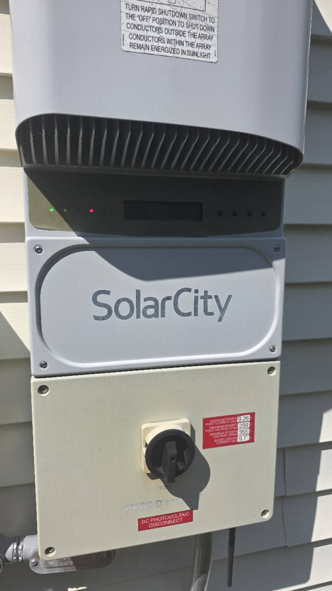
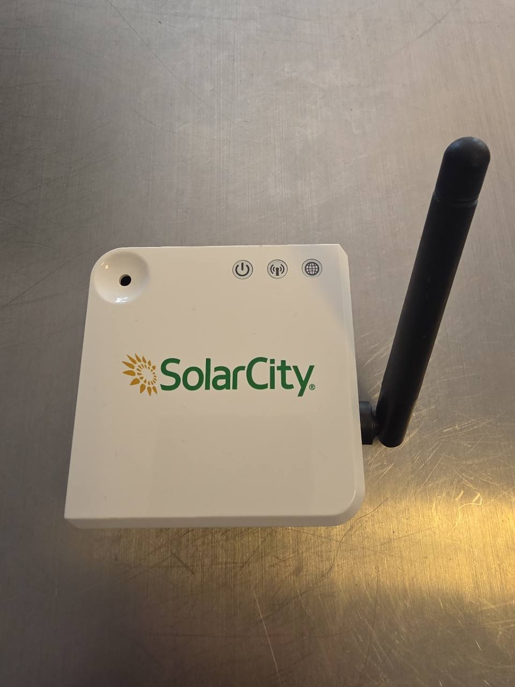

# SolarCity Inverter Radio

A local replacement for the **SolarCity / Tesla solar monitoring box**, using a
SMLIGHT SLZB-06U and Python.

**Tested inverter: Power-One PVI-5000-OUTD-US-Z**, equipped with its SolarCity-era
Digi XBee radio. Power-One is the inverter manufacturer; SolarCity supplied the
monitoring setup this project replaces.

The collector maintains the inverter's existing radio network, answers startup
verification, and reads SunSpec measurements over Modbus RTU. It saves readings
to SQLite and exposes a local JSON API. Normal operation reads
inverter registers and does not require a Tesla account or cloud connection.

**The collector runs on its own.** Use its API with your own software or Home
Assistant, or run the included dashboard as a separate, optional process.
The container runs the collector by default. Set `SOLAR_DASHBOARD=true` to
start the dashboard in that same container.

| Component | Command / interface | Role |
| --- | --- | --- |
| Collector | `uv run --env-file .env python -m collector`, port `8766` | Owns the SMLIGHT connection, gathers readings, saves history, serves JSON |
| Optional dashboard | `uv run python -m dashboard`, port `8765` | Reads the collector API and displays the readings |
| Collector with dashboard | Set `SOLAR_DASHBOARD=true` in the container | Adds the dashboard on port `8765`; the collector API stays on `8766` |
| Home Assistant | [REST sensor example](docs/home-assistant.md) | Reads the collector API directly; the dashboard is optional |

**Status:** experimental, based on one installation. Independent hardware
reproductions and long-term reliability remain unverified.

## Compatibility

| Component | Tested configuration |
| --- | --- |
| Inverter | Power-One PVI-5000-OUTD-US-Z |
| Inverter radio | Legacy Digi XBee, firmware reported as `0x23a6` |
| Bridge | SMLIGHT SLZB-06U with CC2652P |
| Bridge firmware | OpenThread RCP, SMLIGHT build `20260304` |
| Bridge transport | Spinel over TCP port `6638`, UART `460800` |
| Over-the-air protocol | Unsecured legacy Digi Zigbee, stack profile `0` |
| Host | Python 3.12 or newer; tested with 3.12 and 3.14 |

The RCP firmware provides raw IEEE 802.15.4 access. Python supplies the coordinator
behavior. This project does not create a Thread network or use Zigbee2MQTT/ZHA.
Encrypted networks, other inverter families, multiple inverters, and pairing with
a completely new collector identity are not supported or validated here.

The working method **reuses the original collector's EUI-64 and network settings**.
The included [discovery tool](docs/discovery.md) can learn those values from
inverter traffic without a site config or packets from the original collector.
This has been demonstrated on an operating replacement network; discovery from
a fully unjoined inverter remains unverified. If you have the original collector,
keep it powered off while this replacement runs.

### Identify the inverter



Front of the tested **Power-One PVI-5000-OUTD-US-Z**, with SolarCity branding
and the PV DC disconnect below. Use the enclosure as a visual reference, then
confirm the exact model on your equipment's label and check radio compatibility
against the table above. A matching enclosure alone does not confirm support.

### Original SolarCity collector



The original SolarCity monitoring box replaced by this project. The SMLIGHT
SLZB-06U and Python collector take over its radio-network and measurement role.
Keep the original box powered off while running the replacement, which reuses
its radio identity.

## Quick start

**Part 1: collect data.** You can stop after these steps and use the JSON API.
Run one collector per SMLIGHT. Other consumers share its API.

1. Configure the SLZB-06U for the tested RCP firmware and network serial bridge.
   See the [setup guide](docs/setup.md) for firmware details and obtaining your
   network settings.
2. Install [uv](https://docs.astral.sh/uv/getting-started/installation/), then
   get the application and its locked dependencies:

   ```sh
   git clone https://github.com/daltschu22/solar-city-inverter-radio.git
   cd solar-city-inverter-radio
   uv sync --locked
   ```

3. **Run radio discovery.** Start with your SMLIGHT's IP address or hostname.
   The tool scans for the inverter's channel, PAN IDs, and radio identities.

   Use the same SMLIGHT that will run the replacement. Close any other program
   connected to it, including this project's collector, before scanning.
   `--exclusive-radio` confirms that this script has the SMLIGHT to itself;
   scanning resets the SMLIGHT radio into listening mode.

   Run this from the repository folder on your computer. Replace
   `YOUR_BRIDGE_HOST` with the **SMLIGHT's IP address or hostname**—the address
   you use to open its web interface, without `http://` or a trailing slash:

   ```sh
   uv run python tools/discover_radio.py \
     --host YOUR_BRIDGE_HOST \
     --exclusive-radio \
     --output captures/discovery.json \
     --write-env .env
   ```

   Leave the inverter powered and wait about five minutes for the scan to finish.
   If your original SolarCity box is still working, it can stay on during this
   listening step; power it off before starting the replacement in step 6.

   The tool writes `.env` when it finds one complete, consistent candidate.
   If it cannot export, it keeps the report and explains what is missing or
   ambiguous. Follow the [discovery guide](docs/discovery.md#apply-reviewed-values)
   to resolve the result. Existing files are never overwritten.

   If you have a complete, verified configuration for this inverter and network,
   you can reuse it in step 4 and skip the scan.
4. Review the generated `.env` and `captures/discovery.json`. Confirm that the
   selected inverter is yours and the bridge address is correct. The
   [configuration guide](docs/setup.md#environment-variables) explains each
   setting. Both files are private and ignored by Git.

5. Validate without touching the radio:

   ```sh
   uv run --env-file .env python -m collector.config
   ```

6. Power off the original collector, if present, and stop any other program
   connected to the SMLIGHT bridge. Then start the replacement:

   ```sh
   uv run --env-file .env python -m collector
   ```

Read the JSON at <http://127.0.0.1:8766/api/live> or use:

```sh
curl http://127.0.0.1:8766/api/live
```

The collector first listens for 30 seconds, then
maintains the network and waits for an identifiable inverter packet before
polling. Measurements normally update every two minutes. A quiet inverter may
need to return to operation before data appears.

`/api/history?range=24h` returns stored readings. API requests read collected
data; they do not trigger extra radio polls. See the [API guide](docs/api.md)
for fields, timestamps, and handling stale values.

## Part 2: optional dashboard

Leave the collector running. In another terminal, from this repository, run:

```sh
uv run python -m dashboard
```

Open <http://127.0.0.1:8765>. The dashboard connects to the collector on port
`8766` by default and needs only Python's standard library. Stopping or
restarting it leaves collection running. It can also run on a different computer;
see the [dashboard guide](docs/dashboard.md).

To run both in one container, set `SOLAR_DASHBOARD=true`; see the
[container example](docs/dashboard.md#combined-container).
Closing the browser leaves collection running. Stopping the combined container
stops both programs.

## Home Assistant

Home Assistant can read the collector directly using its built-in REST sensors.
The [copyable configuration](docs/home-assistant.md) provides power in W and
cumulative energy in kWh for the Energy dashboard, including availability checks
for stale or missing readings. This works with the dashboard process stopped.

## Documentation

- [Discover radio settings](docs/discovery.md): gather evidence without a preconfigured inverter address.
- [Reproduce the integration](docs/setup.md): hardware, settings, startup, validation, and containers.
- [Radio and measurement protocol](docs/protocol.md): coordinator exchanges, startup reply, wire format, and register reads.
- [Collector API](docs/api.md): read collected data from your own software.
- [Optional dashboard](docs/dashboard.md): a separate viewer for the collector API.
- [Home Assistant](docs/home-assistant.md): REST sensors and Energy dashboard setup.
- [Article draft](docs/article.md): a publishable explanation focused on the useful implementation details.
- [Sources and related projects](docs/references.md): vendor documentation and prior community work.
- [Contributing](CONTRIBUTING.md): offline tests and privacy rules for reports and captures.
- [Agent setup guide](AGENTS.md): instructions for an agent helping configure and run an installation.

## Data and operation

One read-only query is sent every 60 seconds, alternating production power with
energy and diagnostics. The coordinator also handles event-driven replies and
sends link status every 15 seconds. These maintenance packets are separate from
measurement polling. Queries are serialized, and MAC delivery retries are bounded.

Only validated responses create readings. Missing data stays missing. Optional
sunrise/sunset inference can label an overnight gap; it is not a reported inverter
sleep state. No scheduled radio resets or watchdog-setting changes are performed.

The database lives in `data/solar-history.sqlite3` by default. Configuration,
captures, database files, and logs are ignored by Git. Tests use fictional device
identities and synthetic telemetry; no household production history is included.

Both HTTP services bind to localhost by default and have no authentication.
Set `SOLAR_API_BIND` for the collector API or `SOLAR_BIND` for the dashboard when
you intend to expose them on a trusted network. The API includes operational
details and the inverter's reported serial number.

## Development

The source is organized by component:

```text
collector/          Radio network, polling, configuration, SQLite, and JSON API
dashboard/          Web server and static assets
runtime/            Container startup and process supervision
tools/              Discovery, capture, polling, and publication utilities
tests/              Offline Python and JavaScript tests
docs/               Setup, protocol, API, and integration guides
```

Run Python module commands from the repository root. Local configuration stays
there, and the default database is `data/solar-history.sqlite3`.

```sh
uv sync --locked
./check
```

`./check` runs the Python and JavaScript suites and the publication-hygiene check.
Node.js 20 or newer is needed for the JavaScript tests. Tests use a separate,
synthetic configuration and do not connect to a radio.

Dependencies live in `pyproject.toml`; commit `uv.lock` alongside dependency
changes. `.python-version` selects Python 3.12 by default; CI also tests 3.14.
Use `UV_PYTHON=3.14 ./check` to test that version locally.

## License

Project code and documentation are MIT licensed. Bundled Apache ECharts retains
its Apache-2.0 license and notices. See [third-party notices](THIRD_PARTY_NOTICES.md).
This independent project is not affiliated with Tesla, SolarCity, Power-One,
Digi, or SMLIGHT.
