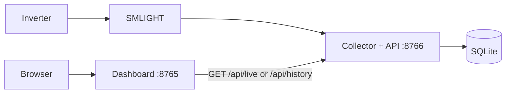

# Optional dashboard

The dashboard is a separate viewer for the [collector API](api.md). The collector
must be running to provide readings. It owns the radio and database; the dashboard
needs only the API URL and Python 3.12 or newer. It does not load radio settings
or require the radio's Python dependencies.

The same dashboard works with **replacement** and experimental **passive**
collection. Choose the radio mode in the
[collector setup guide](setup.md#choose-how-to-collect-readings). In passive mode,
the dashboard shows listening status and observed exchanges; the original box
controls the reading frequency. Missing exchanges leave gaps in the graphs.

With `SOLAR_LATITUDE` and `SOLAR_LONGITUDE` set on the collector, missing nighttime
periods are shown as a muted dashed **estimated 0 W** line between sunset and
sunrise. Measured readings take precedence, including negative values. Daytime
gaps remain blank. Estimates do not create database readings or change energy
totals, sample counts, or the last-response time.

## On the same computer

Finish [part 1: collection](setup.md) and leave the collector running. In another
terminal, from the repository directory:

```sh
uv run python -m dashboard
```

Open <http://127.0.0.1:8765>. The dashboard proxies its read requests to
`http://127.0.0.1:8766`. You can close the browser or stop/restart this process
while the collector keeps gathering data.

On a dashboard-only host with Python 3.12+, run `python3 -m dashboard`.

## On a different computer

Allow the collector API to listen on a trusted network interface. For example,
on the collector computer:

```sh
SOLAR_API_BIND=0.0.0.0 uv run --env-file .env python -m collector
```

On the dashboard computer, set the API URL to the **collector computer**, using
its reachable hostname or IP:

```sh
SOLAR_COLLECTOR_URL=http://COLLECTOR_HOST:8766 python3 -m dashboard
```

The browser talks to the dashboard; the dashboard talks to the collector.
Both services are unauthenticated, so use trusted network access or your own
authenticated reverse proxy.

| Dashboard setting | Default |
| --- | --- |
| `SOLAR_COLLECTOR_URL` | `http://127.0.0.1:8766`; HTTP(S) origin with no path |
| `SOLAR_BIND` | `127.0.0.1`; dashboard listening address |
| `PORT` | `8765`; dashboard HTTP port |

If the collector is unreachable, the dashboard's API requests return `502` and
the UI shows the connection failure. When the collector returns, subsequent
requests resume normally. `/healthz` on the dashboard checks only this viewer.

## Separate dashboard container

With the collector running on the `solar-city` network from the setup guide,
use the same image and override its command to start only the dashboard:

```sh
docker run --rm --name solar-city-dashboard --network solar-city \
  -p 127.0.0.1:8765:8765 \
  -e SOLAR_COLLECTOR_URL=http://solar-city-collector:8766 \
  solar-city-inverter-radio python -m dashboard
```

This command starts only the viewer. It needs no radio config or database mount.
Container DNS resolves `solar-city-collector` on the shared network. Using
`localhost` inside the dashboard container would refer to that container itself.

## Combined container

Use the [collector with dashboard command](setup.md#collector-with-dashboard)
in the setup guide. It enables `SOLAR_DASHBOARD=true` and publishes the dashboard
on port `8765` alongside the collector API on port `8766`.
The combined container supports either collection mode from `.env`;
`SOLAR_DASHBOARD` only controls whether the viewer starts.

The container starts two Python processes:



The collector owns the radio and database. The dashboard proxies `/api/live`
and `/api/history` to its API; these requests never trigger radio polls. The
collector API listens on all container interfaces by default; the example publishes
both ports only to host loopback. `SOLAR_API_PORT` changes the API port, and the
launcher connects the dashboard to that local API automatically. `PORT` sets the
dashboard port; the two ports must differ. `SOLAR_API_BIND` can restrict the API's
listening address. `SOLAR_COLLECTOR_URL` is set automatically in this mode.

Closing the browser leaves collection running. Stopping the container stops
both processes. If either process exits, the launcher stops the other and exits
with an error, so your container service manager can restart the whole service.
It forwards termination signals, waits up to 15 seconds for graceful shutdown,
and reaps both processes. The setup command allows 30 seconds before the container
runtime forces a stop.

[Home Assistant](home-assistant.md) and other API consumers use the
collector on port `8766` whether the dashboard is enabled or not. The dashboard
also proxies `/api/live` and `/api/history` on port `8765`.
