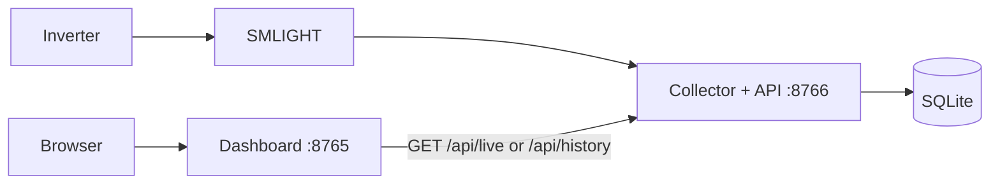

# Optional dashboard

The dashboard is a separate viewer for the [collector API](api.md). The collector
must be running to provide readings. It owns the radio and database; the dashboard
needs only the API URL and Python 3.12 or newer. It does not load `radio.local.json`
or require the radio's Python dependencies.

## On the same computer

Finish [part 1: collection](setup.md) and leave `collector.py` running. In another
terminal, from the repository directory:

```sh
python3 server.py
```

Open <http://127.0.0.1:8765>. The dashboard proxies its read requests to
`http://127.0.0.1:8766`. You can close the browser or stop/restart this process
while the collector keeps gathering data.

## On a different computer

Allow the collector API to listen on a trusted network interface. For example,
on the collector computer:

```sh
SOLAR_API_BIND=0.0.0.0 .venv/bin/python collector.py
```

On the dashboard computer, set the API URL to the **collector computer**, using
its reachable hostname or IP:

```sh
SOLAR_COLLECTOR_URL=http://COLLECTOR_HOST:8766 python3 server.py
```

The browser talks to the dashboard; the dashboard talks to the collector. No
browser CORS configuration is needed. Both services are unauthenticated, so use
trusted network access or your own authenticated reverse proxy.

| Dashboard setting | Default |
| --- | --- |
| `SOLAR_COLLECTOR_URL` | `http://127.0.0.1:8766`; HTTP(S) origin with no path |
| `SOLAR_BIND` | `127.0.0.1`; dashboard listening address |
| `PORT` | `8765`; dashboard HTTP port |

If the collector is unreachable, the dashboard's API requests return `502` and
the UI shows the connection failure. When the collector returns, subsequent
requests resume normally. `/healthz` on the dashboard checks only this viewer.

## Container

With the collector running on the `solar-city` network from the setup guide,
run these commands in another terminal:

```sh
podman build --target dashboard -t solar-city-dashboard -f Containerfile .
podman run --rm --name solar-city-dashboard --network solar-city \
  -p 127.0.0.1:8765:8765 \
  -e SOLAR_COLLECTOR_URL=http://solar-city-collector:8766 \
  solar-city-dashboard
```

The dashboard image contains the web server and static assets. It needs no radio
config or database mount. Container DNS resolves `solar-city-collector` on the
shared network. Using `localhost` inside the dashboard container would refer to
that container itself.

## Combined container

Build with `--target combined` to start the collector and dashboard in one
container. The default build and `--target collector` still run only the collector;
`--target dashboard` still runs only the viewer. These targets work with both
Podman and Docker, using `-f Containerfile`.

Finish radio discovery and fill in `.env` using the
[environment setup](setup.md#environment-variables). Stop any existing collector
that owns the bridge, then:

```sh
podman build --target combined -t solar-city-combined -f Containerfile .
podman volume create solar-city-inverter-radio-data
podman run --rm --name solar-city-combined --stop-timeout 30 \
  -p 127.0.0.1:8765:8765 \
  --env-file .env \
  -v solar-city-inverter-radio-data:/data \
  solar-city-combined
```

Open <http://127.0.0.1:8765>. Existing installations should reuse their history
volume. To use JSON instead of `.env`, replace `--env-file .env` with the
read-only config mount from the [collector setup](setup.md#run-the-collector-in-a-container).

`combined.py` starts two Python processes:



The collector owns the radio and database. The dashboard proxies `/api/live`
and `/api/history` to its API; these requests never trigger radio polls. The
collector API binds to loopback inside the container. `SOLAR_API_PORT` changes
its port, and the launcher sets the dashboard's `SOLAR_COLLECTOR_URL` to that
local API automatically. `PORT` sets the dashboard port; the two ports must differ.
`SOLAR_API_BIND` and `SOLAR_COLLECTOR_URL` are set by the launcher in this mode.

Closing the browser leaves collection running. Stopping the container stops
both processes. If either process exits, the launcher stops the other and exits
with an error, so your container service manager can restart the whole service.
It forwards termination signals, waits up to 15 seconds for graceful shutdown,
and reaps both processes. The example allows 30 seconds before the container
runtime forces a stop.

Home Assistant and other API consumers can use the dashboard's exposed port
(`8765` by default) for the same `/api/live` and `/api/history` endpoints. For
[Home Assistant](home-assistant.md), change the example's resource port from
`8766` to `8765`. The separate collector image exposes its API directly on `8766`.
