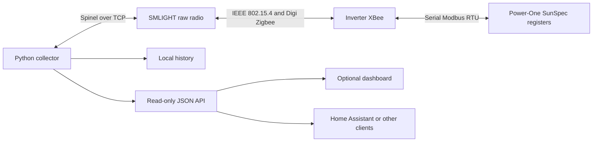
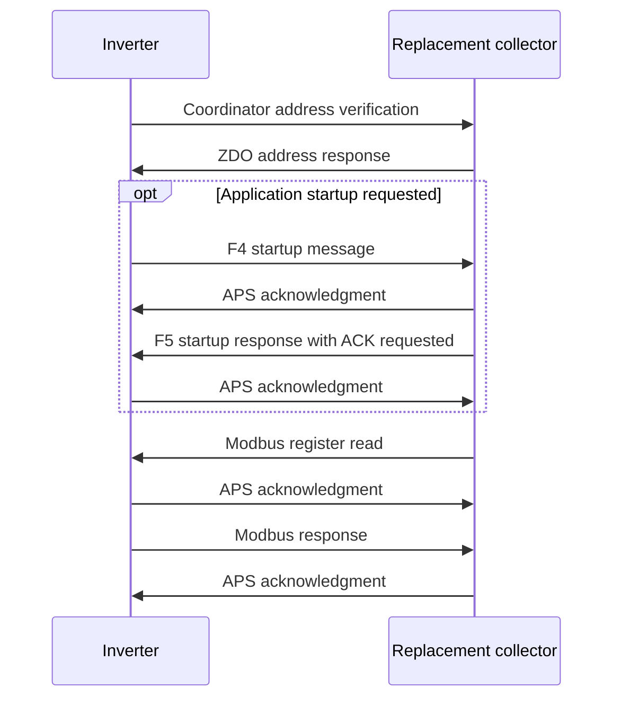

# Radio coordination and measurement protocol

This implementation covers the subset of an unsecured legacy Digi Zigbee network
needed by one known Power-One inverter. The bridge handles the radio and MAC
acknowledgments; Python handles coordinator behavior and application traffic.



## Network maintenance

The coordinator uses short address `0x0000`, the configured EUI-64, and the
installation's channel and PAN identities. Its beacon describes stack profile
`0`. It accepts association and recovery only for the configured inverter.

| Exchange | Implemented behavior |
| --- | --- |
| Beacon request | Advertise the configured legacy network descriptor |
| MAC association request | Queue a reply for the known inverter and set the RCP pending-address table |
| MAC data request | Deliver the queued association response and assigned short address |
| Device announcement | Bind the direct source to the known EUI, persist the address, send link status and one read-only `AI` query |
| ZDO IEEE/network address request | Answer clusters `0x0001`/`0x0000` with `0x8001`/`0x8000`, preserving the transaction number |
| Route request | Return a direct route for the recently identified inverter |
| MAC orphan / NWK rejoin | Recover the known inverter's address |
| Inverter self-leave | Clear the active neighbor and pending measurement, retaining the address for recovery |
| Link status | Send every 15 seconds; advertise the neighbor only while recently heard |

The tested XBee had `JV=1`: startup includes coordinator verification. Its
`NW=0` disabled the separate timer-based network watchdog. These are observed
settings, not configuration writes performed by this project. Digi documents
[JV](https://docs.digi.com/resources/documentation/digidocs/90002002/reference/r_cmd_jv.htm)
and [NW](https://docs.digi.com/resources/documentation/digidocs/90002002/reference/r_cmd_nw.htm)
separately.

A verification request may arrive before a frame establishes the current neighbor.
Answering it does not authorize polling an arbitrary address. Actual measurements
wait for fresh, identifiable inverter traffic. Neighbor freshness expires after
60 seconds. The implementation does not perform automatic network resets.

## Application startup exchange

Three acknowledgments have different purposes:

| Layer | Purpose |
| --- | --- |
| MAC ACK | Confirms delivery of an addressed radio frame; supplied by the RCP |
| APS ACK | Confirms receipt of an APS message using its counter |
| Startup response | Answers the inverter's particular application message |

The observed application exchange is:

```text
Inverter -> collector: f4 00 01 01 01
Collector -> inverter: f5 00 00 00
```

Both use profile `0xc105`, cluster `0x0011`, and endpoints `0xe8`. The collector
also acknowledges the incoming APS message. The `F5` reply uses a fresh APS
counter and requests its own APS acknowledgment. Repeated valid startup messages
can receive replies, limited to one per second.

The exact bytes are supported; the meaning of the proprietary fields is not
fully decoded. They were observed in a working original-collector exchange and
implemented in the replacement. Startup requests and successful reply delivery
were also observed during morning recovery. This does not prove this exchange
explains every possible network departure.



An already joined inverter may proceed to measurements without emitting `F4`.
MAC acknowledgments are omitted from the diagram.

## Measurement request format

```text
TCP stream to the SMLIGHT bridge
  Spinel raw-transmit command
    IEEE 802.15.4 MAC header
      Zigbee network header
        APS header
          Modbus RTU request and CRC
    IEEE 802.15.4 FCS generated by the RCP
```

TCP port `6638` carries Spinel, not Modbus TCP. There is no MBAP header. The
application uses Digi's serial-data profile and endpoints, documented in
[Digi's application profile reference](https://www.digi.com/support/knowledge-base/using-digi-s-applicaiton-s-cluster-id-s-and-end-po).

All measurement requests use Modbus unit `1`, function `3`. These are the literal
addresses transmitted on the wire; do not subtract 40001 as some Modbus tools do.
The observed SunSpec register layout is firmware-specific:

| Read kind | Start | Registers | Purpose |
| --- | ---: | ---: | --- |
| `power` | 40360 | 5 | Model 201 real power and scale factor |
| `energy` | 40380 | 17 | Model 201 exported energy and scale factor |
| `common1` | 40000 | 35 | First part of SunSpec identity |
| `common2` | 40035 | 34 | Remaining identity fields |
| `inverter_ac` | 40069 | 27 | Model 101 AC diagnostics |
| `inverter_dc` | 40096 | 25 | DC values, temperature, state and events |
| `meter_ac` | 40342 | 38 | Model 201 meter diagnostics |

The common identity model is split into two nearby reads. Small diagnostic reads
avoid needing fragmented responses in the production polling path. The offline
decoder can reconstruct supported fragmented captures; the live poller rejects
fragmented responses.

For example, read five registers starting at 40360:

```text
01 03 9d a8 00 05 2b 85
```

`01` is the unit, `03` the function, `9d a8` the starting address, `00 05` the
register count, and `2b 85` the CRC in low-byte-first order. Register values are
big-endian. Synthetic replies in the tests are generated with valid Modbus CRCs.

Model 201 real power uses a signed value at 40360 and a signed scale factor at
40364. A synthetic raw value of `5000` and scale `-1` gives `500.0 W`.
Energy uses the 32-bit value at 40380–40381 and scale at 40396. The model 101
inverter counter is retained as a separate diagnostic; it is not mixed with
model 201 history. Unsupported-value sentinels and missing blocks are omitted,
not converted to zero.

## Polling and response validation

The repeating query cycle is:

```text
power, inverter_ac, power, energy, power, inverter_dc, power, energy,
power, meter_ac, power, common1, power, common2, power, energy
```

One query starts every 60 seconds, with at most one outstanding request and a
five-second response window. Power normally updates every 120 seconds. Each
ACK-requested frame permits three host-managed retries after delivery statuses
17/18, delayed by 0.1, 0.2, and 0.4 seconds. Retries preserve the identical frame.
A transport failure reconnects after 15 seconds and repeats the passive conflict
check. Poll timeouts alone do not trigger radio resets.

Accepted responses must match the known inverter and collector, direct source,
PAN, profile, cluster, endpoints, expected length, Modbus unit/function, and CRC.
Frames flagged with receive errors, bad FCS, or unsupported fragmentation are
rejected. Only power responses create production history rows. Cached energy is
attached to a power row only while at most two minutes old.

The supported decoder is tied to this register map. Confirm identity, model IDs,
addresses, scale factors, and invalid-value handling before adapting another
firmware. The test suite covers encoding, filtering, startup/rejoin behavior,
retries, storage, and chart gaps without transmitting over the air.
